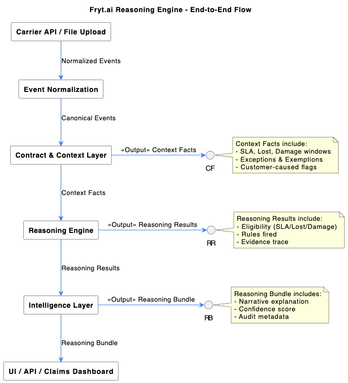

# 🧠 Fryt.ai Reasoning Engine — Architecture Requirements Specification

**Document Version:** v1.0  
**Author:** [Your Name]  
**Last Updated:** October 2025  
**Status:** Draft for Architecture Review  

---

## 1️⃣ Overview

The **Fryt.ai Reasoning Engine** is the intelligence core of the Fryt.ai claims automation platform.  
It transforms **carrier tracking events** and **contractual service-level agreements (SLAs)** into **explainable claim outcomes** such as **SLA refund**, **Lost shipment**, or **Damage claim** eligibility.

This system is designed to be:
- **Carrier-agnostic** — Works across UPS, FedEx, and future carriers.  
- **Deterministic and auditable** — Every decision traceable to event and contract inputs.  
- **Scalable** — Supports millions of shipments daily through stateless reasoning.  
- **Explainable** — Generates transparent, human-readable summaries.  
- **Composable** — Built as discrete layers that can evolve independently.

---

## 2️⃣ Goals

| Category | Description |
|-----------|-------------|
| **Functional Goal** | Automate reasoning for multiple claim types: SLA refund, Lost shipment, and Damage. |
| **Data Goal** | Normalize events across carriers and fuse them with structured contracts. |
| **AI Goal** | Introduce lightweight AI reasoning for ambiguity resolution and narrative generation. |
| **Operational Goal** | Deliver real-time eligibility checks and batch processing at 1M+ shipments/day. |
| **Business Goal** | Provide shippers with transparent, explainable claims intelligence and improve recovery ROI. |

---

## 3️⃣ Architectural Layers — High-Level Model

| Layer | What It Does | Core Components | Typical Outputs |
|--------|---------------|-----------------|-----------------|
| **Contract & Context Layer** | Converts SLAs and claim rules into structured form and applies them to carrier events to derive factual shipment context. | `SLA_RULES`, `CANONICAL_EVENTS`, `CONTRACTUAL_WINDOWS`, `EXCEPTIONS` | Context Facts (e.g., “Delivered 1 day late; no exemptions.”) |
| **Reasoning Engine** | Applies deterministic rules to compute eligibility for SLA, Lost, and Damage claims, creating rule-level evidence. | Rule registry, Evaluator, Context Facts | “SLA refund eligible = true; fired rule = SLA_LATE_DELIVERY.” |
| **Intelligence Layer (Outcome Layer)** | Synthesizes reasoning results into explainable, confidence-scored, and auditable intelligence objects. | LLM summarizer, Confidence scorer, HITL module | `narrative`, `confidence`, `eligibility`, `trace`, `audit` |

---

## 4️⃣ The Contract & Context Layer

### 4.1 Objective
Build the **factual understanding** of a shipment by combining structured contractual logic and canonical carrier events.

This layer answers:
> “What was promised, what happened, and under what conditions?”

---

### 4.2 Key Functions
1. **Contract Parsing:**  
   - Parse carrier contracts into structured, machine-readable JSON (`SLA_RULES`).  
   - Extract all time-bound and condition-based constraints into `CONTRACTUAL_WINDOWS`.  

2. **Event Normalization:**  
   - Convert raw carrier payloads into canonical event codes (`PICKUP`, `IN_TRANSIT`, `DELIVERED`, etc.).  
   - Preserve timezone, facility, and raw text for traceability.  

3. **Contextual Fusion:**  
   - Merge contracts and events to compute derived facts:  
     - SLA promised window  
     - Actual delivery time  
     - Exceptions encountered  
     - Lost/damage thresholds  

4. **Exemption Attribution:**  
   - Identify which exceptions are carrier-caused vs. customer-caused.  
   - Apply exemption logic from contract (e.g., “Weather delay → not eligible”).  

---

### 4.3 Contractual Constructs

| Construct | Applies To | Definition | Example |
|------------|-------------|-------------|----------|
| **Promise Window** | SLA | Time by which delivery must occur per service level. | `2 business days after pickup` |
| **Inactivity Threshold** | Lost | Max days without movement before shipment is considered lost. | `≥7 calendar days` |
| **Damage Evidence Window** | Damage | Max hours allowed for filing damage claim. | `72 hours` |
| **Filing Window** | All claims | Deadline to submit claim after delivery or loss. | `15 business days` |
| **Exemptions** | All claims | Exceptions that void eligibility (e.g., weather). | `["WEATHER", "CUSTOMS"]` |
| **Liability Cap** | All claims | Maximum monetary recovery limit. | `$100 per package` |

---

### 4.4 Example — Context Facts for a Shipment

```json
{
  "tracking_number": "1Z12345...",
  "carrier": "UPS",
  "service_level": "2DAY_AIR",
  "sla_promise": {
    "end_ts": "2025-10-06T23:59:59-04:00",
    "late_business_days": 0.4,
    "exempted": false
  },
  "lost_facts": {
    "days_since_last_scan": 8,
    "has_pickup_scan": true
  },
  "damage_facts": {
    "has_damage_event": true,
    "reported_within_hours": 36,
    "evidence_ok": true
  },
  "exemptions_applied": []
}
```

---

## 5️⃣ The Reasoning Engine

### 5.1 Objective
Transform contextual facts into **deterministic decisions** by applying logical rules.  
This layer answers:
> “Did the carrier fulfill its contractual obligation?”

---

### 5.2 Rule Framework

Each rule follows a standard pattern:
```json
{
  "rule_id": "RULE_NAME",
  "when": [...conditions...],
  "then": [...actions...],
  "priority": <integer>
}
```

Rules can be grouped by claim type (SLA, Lost, Damage) and executed in parallel.

---

### 5.3 Deterministic Rule Examples

#### SLA Late Delivery
```json
{
  "rule_id": "SLA_LATE_DELIVERY",
  "when": [
    {"fact": "sla_promise.late_business_days", "op": "gt", "value": 0},
    {"fact": "sla_promise.exempted", "op": "eq", "value": false},
    {"fact": "customer_caused", "op": "eq", "value": false}
  ],
  "then": [
    {"set": "eligibility.sla_refund", "value": true},
    {"append": "reasons", "value": "Delivered after promised window"}
  ]
}
```

#### Lost Shipment
```json
{
  "rule_id": "LOST_NO_MOVEMENT",
  "when": [
    {"fact": "lost_facts.days_since_last_scan", "op": "gte", "value": 7},
    {"fact": "final_status", "op": "neq", "value": "DELIVERED"}
  ],
  "then": [
    {"set": "eligibility.lost", "value": true},
    {"append": "reasons", "value": "No movement ≥ 7 days"}
  ]
}
```

#### Damage Claim
```json
{
  "rule_id": "DAMAGE_REPORTED",
  "when": [
    {"fact": "damage_facts.has_damage_event", "op": "eq", "value": true},
    {"fact": "damage_facts.reported_within_hours", "op": "lte", "value": 72}
  ],
  "then": [
    {"set": "eligibility.damage", "value": true},
    {"append": "reasons", "value": "Damage reported within 72 hours"}
  ]
}
```

---

### 5.4 Example — Reasoning Results

```json
{
  "tracking_number": "1Z12345...",
  "eligibility": {
    "sla_refund": true,
    "lost": false,
    "damage": false
  },
  "rules_fired": [
    {"rule_id": "SLA_LATE_DELIVERY", "evidence": ["AFTER_PROMISE", "NO_EXEMPTIONS"]}
  ],
  "final_status": "DELIVERED"
}
```

---

## 6️⃣ The Intelligence Layer (Outcome)

### 6.1 Objective
Transform decisions into human-readable, confidence-scored, and auditable intelligence.  
This layer answers:
> “Why did the engine make this decision, and how confident are we?”

---

### 6.2 Key Features

| Feature | Description |
|----------|-------------|
| **Explainability Engine** | Converts reasoning traces into natural-language narratives. |
| **Confidence Scoring** | Quantifies decision reliability based on data completeness and inference reliance. |
| **Human-in-the-Loop (HITL)** | Allows manual overrides and tracks audit trails. |
| **Reasoning Bundle** | Unified JSON combining eligibility, narrative, confidence, and audit metadata. |

---

### 6.3 Example — Reasoning Bundle

```json
{
  "tracking_number": "1Z12345...",
  "final_status": "DELIVERED",
  "eligibility": {"sla_refund": true, "lost": false, "damage": false},
  "narrative": "Shipment delivered on Oct 7, 2025, one day later than promised. No exemptions applied. Eligible for SLA refund.",
  "confidence": 0.88,
  "trace": {
    "rules_fired": ["SLA_LATE_DELIVERY"],
    "canonicalization_version": "v0.4.2",
    "rules_version": "2025-10-01"
  },
  "audit": {
    "created_at": "2025-10-06T19:14:00Z",
    "last_override_user": null
  }
}
```

---

### 6.4 Confidence Calculation Example

| Factor | Description | Weight | Example Value | Weighted Score |
|--------|--------------|--------|----------------|----------------|
| **Data Completeness** | All required events present | 0.30 | 0.9 | 0.27 |
| **Contract Certainty** | Fully structured contract available | 0.25 | 1.0 | 0.25 |
| **Exemption Clarity** | Clear mapping of exception codes | 0.20 | 0.8 | 0.16 |
| **Heuristic Reliance** | Degree of inferred data used | 0.15 | 0.7 | 0.10 |
| **Override Penalty** | Manual override applied? | 0.10 | 1.0 | 0.10 |
| **→ Total Confidence** |  |  |  | **0.88** |

---

### 6.5 Human-in-the-Loop Override Example

```json
{
  "tracking_number": "1Z12345...",
  "override": {
    "field": "sla_promise.exempted",
    "old_value": false,
    "new_value": true,
    "user_id": "ops_user_17",
    "rationale": "Weather delay confirmed by customer.",
    "timestamp": "2025-10-06T21:00:00Z"
  }
}
```

---

## 7️⃣ End-to-End Flow (PlantUML)



---

## 8️⃣ Architectural Design Requirements

| Category | Requirement |
|-----------|-------------|
| **Data Normalization** | Canonical event codes must abstract across carriers with a 95%+ mapping rate. |
| **Contract Structuring** | Contract parser must extract all `CONTRACTUAL_WINDOWS` constructs and exemptions. |
| **Determinism** | Same input must always yield identical eligibility and reasoning trace. |
| **Performance** | Process 1M+ shipments/day with <200ms median reasoning time. |
| **Explainability** | Every decision must include a rule trace, narrative, and confidence score. |
| **Auditability** | All overrides and re-evaluations must retain full lineage (who, when, why). |
| **Extensibility** | New carriers can be added via configuration, not code duplication. |
| **Security** | Data encrypted at rest and in transit; no PII beyond shipment metadata. |

---

## 9️⃣ Summary

| Layer | Key Output | Description |
|--------|-------------|-------------|
| **Contract & Context Layer** | Context Facts | Establishes factual shipment basis from contracts + events. |
| **Reasoning Engine** | Reasoning Results | Applies rules to determine claim eligibility. |
| **Intelligence Layer** | Reasoning Bundle | Produces explainable, confidence-scored claim intelligence. |

> **Outcome:**  
> A scalable, deterministic, and transparent reasoning architecture that turns fragmented carrier data and complex SLAs into actionable shipment intelligence — enabling Fryt.ai to automate, explain, and optimize the claims process across all carriers.
